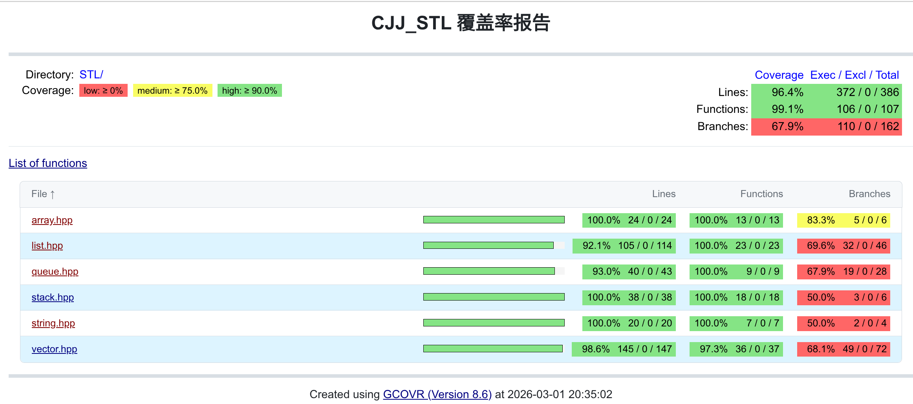

# CJJ_STL

## 背景

想了解c++中STL的具体实现，加上之前是打算法竞赛的，有点怀念写数据结构的感觉，想自己实现一些常用的STL容器

## 预计产出(简单版)

- [x] array
- [x] vector
- [ ] allocator
- [ ] iterator
- [x] list
- [x] stack
- [ ] queue
- [ ] priority_queue
- [ ] set
- [ ] map
- [ ] unordered_set
- [ ] unordered_map
- [x] string


## 规划

由浅入深，先实现基本功能，再考虑真实stl的实现，包括内存管理、线程安全等.

## 测试

```shell
make build GCOVR=ON
make test
gcovr -r .
```

  

<br>

## 收获

### gcovr过滤操作

```shell
# 正确路径
gcovr -r . --filter STL/

# 错误用法
gcovr -r . --filter ./STL/
```

<br>

## 参考

[1] array、vector：https://www.cnblogs.com/zhangyi1357/p/16009968.html  
[2] list、list_iterator：https://www.cnblogs.com/wengle520/p/12492708.html  